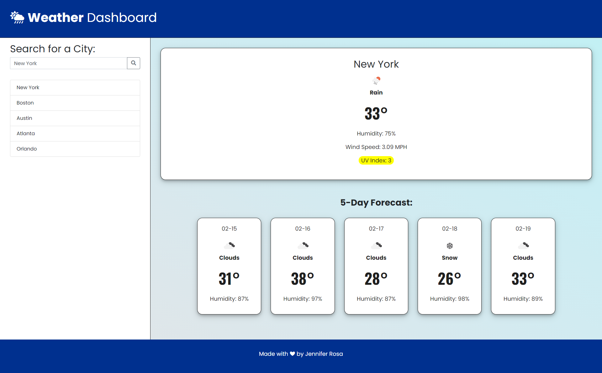

# ☀ Weather Dashboard

A weather dashboard that provides current and future weather forecasts. Utilizes OpenWeather API to retrieve weather data for cities and incorporates localStorage to store data.

## Deployment

### Version 2

Demo: https://rosajen27.github.io/weather-dashboard/

### Version 1

## Built With

  * HTML
  * CSS
  * JavaScript
  * jQuery
  * OpenWeather API

## Acknowledgments

  * Trilogy Education Services
